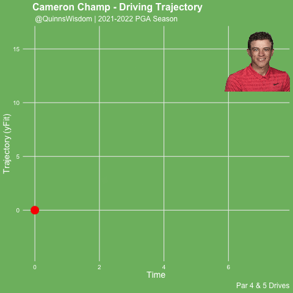

# golfR

## Features

-   extracting PGA tour shot by shot data, radar Data, and shot trajectory data
-   Pull stats leaderboards by tournament
-   Pull player lists for PGA affiliated tours (PGA, Korn Ferry, PGA Canada, etc)
-   Scrape ESPN leaderboard
-   List of Tournament Ids

Stat ID Reference: <https://github.com/qmaclean/golfR/blob/main/man/Stat_ID.md>

## To-do

-   Create a scorecard function to scrape data for non-shot link events and get data prior to 2020
-   Add load functions for previous data
-   Find LPGA stats
-   Modify ESPN scraping script to a function
-   LIV golf stat
-   Create a golf plotter function
-   Create a Master's data scraper (separate website)
-   Find course view images for plot

Still To-do:

-   Find missing course/tournament IDs for PGA tour
-   Fix pbp scraping function to exit and return results after url can't find results after 2nd failed attempt on 1st or 2nd loop (not by hole)
-   Call out rounds that don't have pbp data

## Viz Samples

